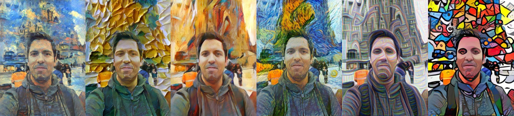

<!-- Personal Info -->


{% assign dob = site.data.personal.date_of_birth | date: '%Y-%m-%d' %}



<!-- Professional Info -->








	
		
	


My name is {{ firstName }} {{ lastName }}, I'm `0x{{ dob | age | hex }}` years old, and I'm based in {{ city }}, {{ country }}.

I've built ML at [Siemens](https://www.siemens.com/), wrangled startups at [AWS](https://aws.amazon.com/), and now lead AI at [Critical Software](https://www.criticalsoftware.com/en).

I'm on a mission to [build AI that solves real problems for real people](https://dependable.critical-ai.dev).

[📄 Long CV](/assets/documents/cv_long.pdf){: .btn} // [<small>📃 shorter cv</small>](/assets/documents/cv_shorter.pdf){: .btn}

