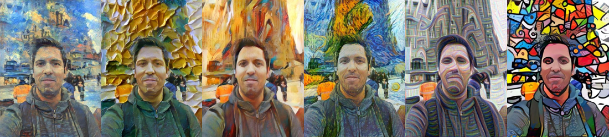

<!-- Personal Info -->


{% assign dob = site.data.personal.date_of_birth | date: '%Y-%m-%d' %}



<!-- Professional Info -->





## `std::cout << "Hi everyone!\n"; 👋`

My name is {{ firstName }} {{ lastName }}, I’m `0x`{{ dob | age | hex }} y/o, and I live in {{ city }}, {{ country }}.

I love fixing the ~~un~~fixable, building the ~~im~~possible and learning new things along the way.

I live by Feynman's credo: **everything** is interesting if you go deep enough 🐇 🕳️.

## What's new?


[{{ post.title }}]({{ post.url }})

