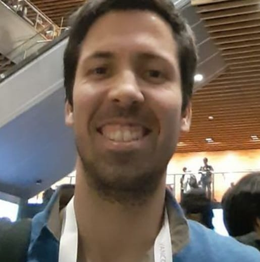

## About me

📍 [{{ site.data.location.city }}, {{ site.data.location.country }}]({{ site.data.location.maps }})

I am a certified Physics nerd 🌌 and an amateur forensic scientist 🕵️ with a keen interest in solving challenging problems with real-world applications 🌍.

I've worked as a data analyst, software tester, DevOps engineer and ML consultant for several companies, in areas ranging from market research to fiber optic telecommunications and mobility.




Currently, I work as a {{ currentJob.role }} at [{{ currentJob.where.name }}]({{ currentJob.where.link }}), while pursuing a {{ currentEdu.degree }} degree in {{ currentEdu.area }} at [{{ currentEdu.where.name }}]({{ currentEdu.where.link }}). My research focuses on the application of ML algorithms to improve the performance of EEG-based brain-computer interfaces 🧠.

When I'm not working, you can usually find me browsing the local bookstore 📚, participating in hackathons 🐱‍💻 or enjoying some quality family time 👪.

Follow me on  or  for additional content.

## What's new?


[{{ post.title }}]({{ post.url }})
