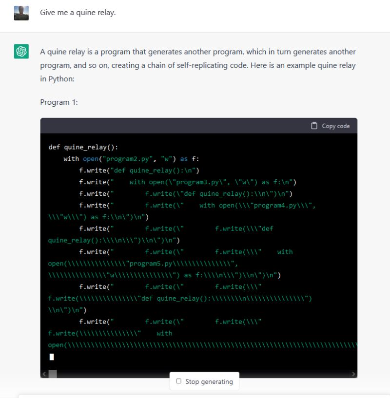

## Useful Links

For AI practitioners 🧠

* Here's a curated list of essential papers that every AI practitioner should read (though most won't):
    - [A Few Useful Things to Know about Machine Learning](https://dl.acm.org/doi/10.1145/2347736.2347755) by Domingos
    - [Machine Learning that Matters](https://arxiv.org/abs/1206.4656) by Wagstaff
    - [Tidy Data](https://vita.had.co.nz/papers/tidy-data.html) by Wickham
    - [Hidden Technical Debt](https://papers.nips.cc/paper_files/paper/2015/hash/86df7dcfd896fcaf2674f757a2463eba-Abstract.html) (yes, that one!) by Sculley & Co.
* [Awesome Safety-Critical AI](https://awesome.critical-ai.dev) is a curated collection of resources on AI applications in high-stakes domains
* Some of my older articles on [AWS Community](https://community.aws/@jgalego)

<iframe width="70%" height="300px" src="https://critical-ai.dev/GenAI">
Your browser doesn't support iframes? Really?!
</iframe>

<iframe width="70%" height="300px" src="https://critical-ai.dev/MappingEmbeddings">
Your browser doesn't support iframes? Really?!
</iframe>

For startups 🐣

* [Y Combinator Startup School](https://www.startupschool.org/) is a *free* 8-week online course covering the fundamentals of starting a company
* [Paul Graham's essays](http://www.paulgraham.com/articles.html) on startups and entrepreneurship are absolute gems - be sure to check out his pieces on [how to get startup ideas](http://www.paulgraham.com/startupideas.html) and the [18 mistakes that kill startups](http://www.paulgraham.com/startupmistakes.html)
* Peter Thiel's [Zero to One: Notes on Startups, or How to Build the Future](https://www.amazon.com/Zero-One-Notes-Startups-Future/dp/0804139296) is essential reading - you may not agree with everything he writes (I don't), but you won't stay indifferent
* [Startup Stash](https://startupstash.com/) offers an extensive collection of tools for startups and entrepreneurs
* Perhaps not surprisingly, most AWS-flavored resources for startups can be found at [AWS Startups](https://aws.amazon.com/startups)

<!-- Cartman's 4 point business plan -->

For people in a hurry 🏃 💨

* [Learn X in Y minutes](https://learnxinyminutes.com/) offers a quick tour of ([almost](https://github.com/adambard/learnxinyminutes-docs/issues)) every programming language
* [Icons](https://thenounproject.com/) and [emojis](https://emojidb.org/) for every occasion
* Feeling too lazy to implement a classic algorithm? Check out [The Algorithms](https://the-algorithms.com/), GitHub's largest open-source algorithm library
* Want the fastest way to use ML models? Try [Hugging Face 🤗 Models](https://huggingface.co/models) online for *free*
* Need an API for your project? This [comprehensive list of publicly available APIs](https://github.com/public-apis/public-apis) may come in handy
* Having a hard time debugging your code? Consider investing in a [rubber duck](https://rubberduckdebugging.com/) (of the bathtub persuasion)

<!-- Ernie rubber duck debugging -->

## (Supposedly) Fun Things

* [Nand2Tetris](https://www.nand2tetris.org/) teaches you how to build a modern computer from first principles - it has spawned all kinds of incredible projects, including a [16-bit ALU implementation in Minecraft](https://hackaday.com/2010/09/29/16-bit-alu-in-minecraft/) ⛏🧱
* The new edition of [Code: The Hidden Language of Computer Hardware and Software](https://www.codehiddenlanguage.com/) by Charles Petzold is an absolute treasure - it covers everything from playing with flashlights 🔦 with your best friend to the *"worldwide hum of the internet"* 🌐
* Erik Demaine's [lectures on data structures, algorithms and programming](https://erikdemaine.org/classes/) are mind-blowing - be sure to watch his talks on [models of computation and document distance](https://ocw.mit.edu/courses/6-006-introduction-to-algorithms-fall-2011/resources/lecture-2-models-of-computation-document-distance/) (I guarantee you'll never look at your Python scripts the same way again) and [temporal data structures](http://courses.csail.mit.edu/6.851/spring21/lectures/L01.html) (expect time travel analogies 🕓🚀 and movie references)
* Kevin Zurawel's [Game Development in 8 Bits or... Stupid NES Tricks](https://www.youtube.com/watch?v=TPbroUDHG0s) is a masterclass in creative limitations
* [Choose Boring Technology](https://boringtechnology.club/) or *"how to be old, for young people"*
* Terry Tao's [attempts to formalize a paper](https://terrytao.wordpress.com/2023/11/18/formalizing-the-proof-of-pfr-in-lean4-using-blueprint-a-short-tour/) on a [conjecture by Katalin Marton](https://terrytao.wordpress.com/2023/11/13/on-a-conjecture-of-marton/) using [Lean4](https://lean-lang.org/)
* Peter Norvig's [pytudes](https://github.com/norvig/pytudes) - delightful in both size and form
* Bartosz Ciechanowski's [interactive articles](https://ciechanow.ski/) will make you look at ordinary things in completely new ways
* Evan Miller's [comprehensive A/B testing tools](https://www.evanmiller.org/ab-testing/) - ideal for planning and analyzing experiments
* [MinutePhysics](https://www.youtube.com/c/minutephysics) uses whiteboard animation to explain physics concepts brilliantly - the video on [boat wakes](https://www.youtube.com/watch?v=95sQcSulRFM) is a personal favorite
* Anything by [3Blue1Brown](https://www.youtube.com/@3blue1brown)... [here's](https://www.youtube.com/watch?v=rbu7Zu5X1zI) how he creates those amazing animations using [Manim](https://github.com/3b1b/manim)
* If brown paper math derivations tickle your fancy, check out [Numberphile](https://www.youtube.com/user/Numberphile)
* [Imagine calling someone on the phone, saying hello, then putting them on hold... 🤦‍♀️](https://nohello.net/en/) Please don't say just hello in chat

## (Actually) Fun Things

* [xkcd](https://xkcd.com) - a webcomic of romance, sarcasm, math, and language
* [SMBC](https://smbc-comics.com) - a webcomic that covers science, research, superheroes, religion, romance, dating, parenting, and the meaning of life (phew!)
* [IP over Avian Carriers](https://datatracker.ietf.org/doc/html/rfc1149) - an IETF RFC for... well, the name says it all 🐦; contains memorable lines like *"because IP only guarantees best effort delivery, loss of a carrier can be tolerated"*

## Meta Stuff

* If you get excited by things like `_='_=%r;print(_%%_)';print(_%_)`, then you'll absolutely love [Quine Relay](https://github.com/mame/quine-relay)
    - It's also the nerdiest way to send [ChatGPT](https://openai.com/blog/chatgpt/) into an [infinite loop](https://www.linkedin.com/posts/jgalego_chatgpt-activity-7019613458753011712-Tlsi?utm_source=share&utm_medium=member_desktop) ♾️💥
    

<!-- ChatGPT on Quine Relay -->

* There's a GitHub repo with an [awesome list](https://github.com/sindresorhus/awesome) of awesome lists - sounds like [Russell's paradox](https://plato.stanford.edu/entries/russell-paradox/) to me!
* Few things are as meta as Douglas Hofstadter's [GEB](https://www.amazon.com/G%C3%B6del-Escher-Bach-Eternal-Golden/dp/0465026567), an exploration of self-reference and recursion featuring a wonderful ensemble of Carroll-inspired characters
* A recent (meta-)piece for *The Atlantic* on why [`meta` doesn't mean what you think it does](https://www.theatlantic.com/newsletters/archive/2022/06/meta-origin-irony/661191/)
* An [implementation of PartyRock](https://partyrock.aws/u/mza/pDK3iF1kb/PartyRocket-build-web-apps-with-gen-AI) by Matt Wood (former VP of AI @ AWS) built in [PartyRock](https://partyrock.aws/), an [Amazon Bedrock](https://aws.amazon.com/bedrock/) playground
* Finally, here's a warning sign warning you about warning signs - consider yourself warned! 🚨

<!-- Meta Warning Sign -->

