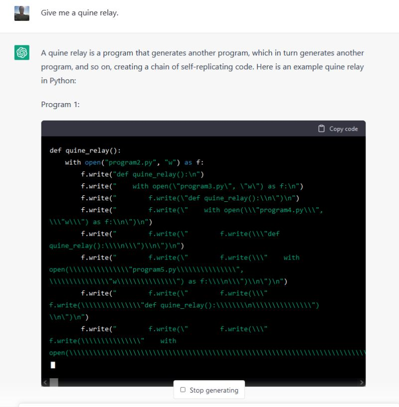

## Useful Links

For AI practitioners 🧠

* Essential papers that shaped modern AI and ML — every practitioner should read these at least once:
    - [A Few Useful Things to Know about Machine Learning](https://dl.acm.org/doi/10.1145/2347736.2347755) by Domingos
    - [Machine Learning that Matters](https://arxiv.org/abs/1206.4656) by Wagstaff
    - [Tidy Data](https://vita.had.co.nz/papers/tidy-data.html) by Wickham
    - [Hidden Technical Debt](https://papers.nips.cc/paper_files/paper/2015/hash/86df7dcfd896fcaf2674f757a2463eba-Abstract.html) by Sculley et al.
    - [The Unreasonable Effectiveness of Data](https://static.googleusercontent.com/media/research.google.com/en//pubs/archive/35179.pdf) by Halevy, Norvig, and Pereira
* If you want to work on AI for high-stakes domains, check out [Awesome Safety-Critical AI](https://awesome.critical-ai.dev)
* I can't edit them anymore, but some of my older articles are still available on [AWS Community](https://community.aws/@jgalego)

<iframe width="70%" height="300px" src="https://dependable.critical-ai.dev">
Your browser doesn't support iframes? Really?!
</iframe>

<iframe width="70%" height="300px" src="https://critical-ai.dev/GenAI">
Your browser doesn't support iframes? Really?!
</iframe>

<iframe width="70%" height="300px" src="https://critical-ai.dev/MappingEmbeddings">
Your browser doesn't support iframes? Really?!
</iframe>

For startups 🐣

* [Y Combinator Startup School](https://www.startupschool.org/) offers a *free* 8-week crash course in startup fundamentals — don't miss it
* [Paul Graham's essays](http://www.paulgraham.com/articles.html) are absolute gems that cut through the entrepreneurship noise — start with [how to get startup ideas](http://www.paulgraham.com/startupideas.html) and [18 mistakes that kill startups](http://www.paulgraham.com/startupmistakes.html)
* Peter Thiel's [Zero to One: Notes on Startups, or How to Build the Future](https://www.amazon.com/Zero-One-Notes-Startups-Future/dp/0804139296) is provocative and essential — you won't agree with everything (I don't!), but you won't stay indifferent
* [Startup Stash](https://startupstash.com/) curates an extensive toolkit for startup founders and entrepreneurs

<!-- Cartman's 4 point business plan -->

For people in a hurry 🏃 💨

* [Learn X in Y minutes](https://learnxinyminutes.com/) delivers a whirlwind tour of ([almost](https://github.com/adambard/learnxinyminutes-docs/issues)) every programming language — perfect for when you need to pick up a new language yesterday
* [Icons](https://thenounproject.com/) and [emojis](https://emojidb.org/) for every occasion and mood
* Too lazy to implement that classic algorithm? [The Algorithms](https://the-algorithms.com/) has you covered with GitHub's largest open-source algorithm library
* [Hugging Face 🤗 Models](https://huggingface.co/models) lets you experiment with cutting-edge ML models online — completely *free*
* Need an API? This [comprehensive list of publicly available APIs](https://github.com/public-apis/public-apis) is your new best friend
* Stuck debugging? Invest in a [rubber duck](https://rubberduckdebugging.com/) — yes, the bathtub kind works best

<!-- Ernie rubber duck debugging -->

## (Supposedly) Fun Things

* [Nand2Tetris](https://www.nand2tetris.org/) is a journey from NAND gates to Tetris — build a complete modern computer from first principles. It has inspired incredible projects like a [16-bit ALU in Minecraft](https://hackaday.com/2010/09/29/16-bit-alu-in-minecraft/) ⛏🧱
* Charles Petzold's [Code: The Hidden Language of Computer Hardware and Software](https://www.codehiddenlanguage.com/) is an absolute masterpiece that takes you from flashlight morse code 🔦 to the *"worldwide hum of the internet"* 🌐
* Erik Demaine's [lectures on algorithms and data structures](https://erikdemaine.org/classes/) will bend your mind in the best way — his talks on [models of computation](https://ocw.mit.edu/courses/6-006-introduction-to-algorithms-fall-2011/resources/lecture-2-models-of-computation-document-distance/) will forever change how you see Python scripts, while [temporal data structures](http://courses.csail.mit.edu/6.851/spring21/lectures/L01.html) comes with time travel analogies 🕓🚀 and movie references
* Kevin Zurawel's [Game Development in 8 Bits or... Stupid NES Tricks](https://www.youtube.com/watch?v=TPbroUDHG0s) is a masterclass in thriving within creative constraints
* [Choose Boring Technology](https://boringtechnology.club/) — or *"how to be old, for young people"*
* Watch Terry Tao [formalize a proof](https://terrytao.wordpress.com/2023/11/18/formalizing-the-proof-of-pfr-in-lean4-using-blueprint-a-short-tour/) of a [Marton conjecture](https://terrytao.wordpress.com/2023/11/13/on-a-conjecture-of-marton/) in [Lean4](https://lean-lang.org/) — mathematics meets type theory
* Peter Norvig's [pytudes](https://github.com/norvig/pytudes) are Python programs that are both delightful and instructive
* Bartosz Ciechanowski's [interactive articles](https://ciechanow.ski/) transform mundane objects into fascinating explorations of physics and engineering
* Evan Miller's [A/B testing tools](https://www.evanmiller.org/ab-testing/) — everything you need to design and analyze rigorous experiments
* [MinutePhysics](https://www.youtube.com/c/minutephysics) explains complex physics in minutes using brilliant whiteboard animations — the [boat wakes](https://www.youtube.com/watch?v=95sQcSulRFM) video is pure joy
* Everything by [3Blue1Brown](https://www.youtube.com/@3blue1brown) is visual mathematics at its finest... [here's how](https://www.youtube.com/watch?v=rbu7Zu5X1zI) he creates those mesmerizing animations with [Manim](https://github.com/3b1b/manim)
* Love brown-paper math? [Numberphile](https://www.youtube.com/user/Numberphile) has you covered
* [Please don't say just hello in chat](https://nohello.net/en/) — imagine calling someone, saying hello, then immediately putting them on hold 🤦‍♀️

## (Actually) Fun Things

* [xkcd](https://xkcd.com) — the webcomic where romance meets sarcasm, math meets language, and nerds feel understood
* [SMBC](https://smbc-comics.com) — tackling science, philosophy, superheroes, religion, romance, parenting, and the meaning of life with equal parts wit and wisdom
* [IP over Avian Carriers (RFC 1149)](https://datatracker.ietf.org/doc/html/rfc1149) — networking via carrier pigeons 🐦, featuring gems like *"because IP only guarantees best effort delivery, loss of a carrier can be tolerated"*

## Meta Stuff

* Love self-replicating code like `_='_=%r;print(_%%_)';print(_%_)`? You'll be obsessed with [Quine Relay](https://github.com/mame/quine-relay)
    - Bonus: it's the most elegant way to crash [ChatGPT](https://openai.com/blog/chatgpt/) with an [infinite loop](https://www.linkedin.com/posts/jgalego_chatgpt-activity-7019613458753011712-Tlsi?utm_source=share&utm_medium=member_desktop) ♾️💥
    

<!-- ChatGPT on Quine Relay -->

* GitHub hosts an [awesome list](https://github.com/sindresorhus/awesome) of awesome lists — cue [Russell's paradox](https://plato.stanford.edu/entries/russell-paradox/)
* Douglas Hofstadter's [Gödel, Escher, Bach](https://www.amazon.com/G%C3%B6del-Escher-Bach-Eternal-Golden/dp/0465026567) is the ultimate journey into self-reference and recursion, featuring Carroll-inspired dialogues and mind-bending insights
* *The Atlantic* explores why [`meta` doesn't mean what you think it does](https://www.theatlantic.com/newsletters/archive/2022/06/meta-origin-irony/661191/) — a meta-commentary on meta itself
* Matt Wood (former VP of AI @ AWS) built [PartyRock inside PartyRock](https://partyrock.aws/u/mza/pDK3iF1kb/PartyRocket-build-web-apps-with-gen-AI) — recursion meets [Amazon Bedrock](https://aws.amazon.com/bedrock/)
* A warning sign warning you about warning signs — you've been warned! 🚨

<!-- Meta Warning Sign -->

